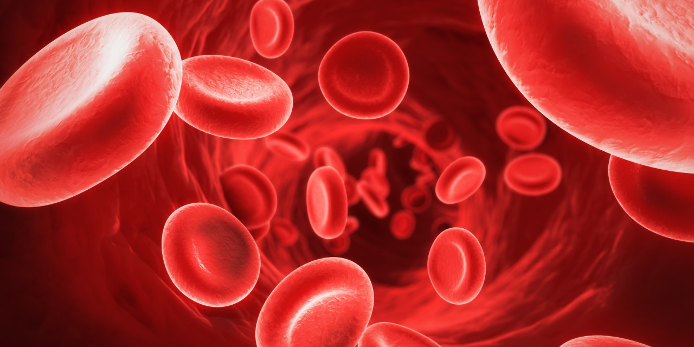

# Anemia Diagnosis with Statsmodels Regression

This [data set](https://www.kaggle.com/saurabhshahane/anemia-diagnosis-dataset) presents the prevalence of different types of Anemia including it’s severity and association with age and gender of the study population with CBC data set parameters as variables. 
The dataset was generated from complete blood count test performed by Hematology analyzer to determine the prevalence of different types of Anemia treated at the Eureka diagnostic center in Lucknow, India. 

All the procedures for the CBC test were done following standard operating protocols defined for the Hematology analyzer. 
For CBC investigation, 400 patient samples were randomly selected to compute the dataset from the patients who visited the Eureka diagnostic center in Lucknow for various clinical examinations. The diagnostic center performs 4 – 8CBC investigations a day on average. During the data collection period between September 2020 to December 2020, 1000 CBC investigations were performed, out of which 400 random samples were selected. We included adult males and females who are not pregnant and older than 15 years of age in the study population. Infants, young children less than 10 years old and pregnant women were excluded from the study due to various factors like variable CBC test values and other factors. After excluding the above stated persons from the randomly chosen sample of 400 patients, we were left with 364 patients in the final data set.

## Kaggle Link
https://www.kaggle.com/saurabhshahane/anemia-diagnosis-dataset

## Results

  

## Acknowledgements
Vohra, Rajan; pahareeya, jankisharan; Hussain, Abir (2021), “Complete Blood Count Anemia Diagnosis”, Mendeley Data, V1, doi: 10.17632/dy9mfjchm7.1

